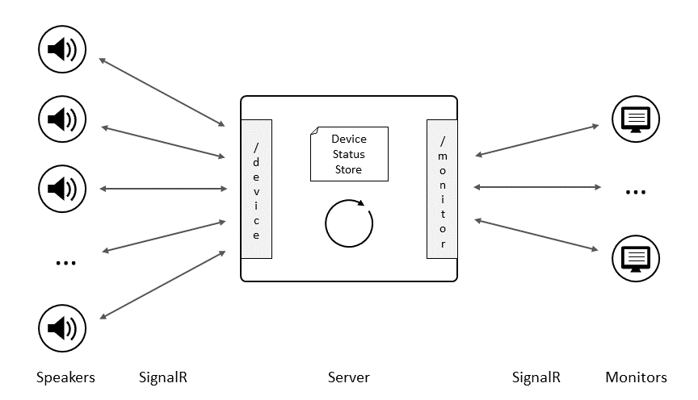

# Introduction

This repo contains the code for a fictuous **I**ntranet **o**perated **T**otal **A**udio **S**olution for airports.
It also is a [Manning liveProject](https://liveproject.manning.com/) titled [Bulding **IoT A**pplications with **S**ignalR](https://www.manning.com/liveproject/building-iot-applications-with-signalr) exercise. 

The liveProject consists of four milestones:

1.	Create a basic setup
2.	Enable real-time audio transfer
3.	Enable IoT applications to run as a single cluster
4.	Enable deployment via Docker

Currently this repository is at the first milestone.

## Technologies used
The solution needs to be build with [.NET 5](https://docs.microsoft.com/en-us/dotnet/core/dotnet-five) and 
[SignalR Core](https://docs.microsoft.com/en-us/aspnet/core/signalr/introduction?view=aspnetcore-5.0) technologies.
While the original assignment is to use Javascript for the management website with real-time information,
I have decided to use [Blazor](https://docs.microsoft.com/en-us/aspnet/core/blazor/?view=aspnetcore-5.0) WASM instead.

## Functional Objectives
The ultimate goal of this project is to build an IoT solution that distributes audio recordings in real-time to various
inter/intranet connected smart public address speakers in an airport. Furthermore it allows operators to view the status of the IoT devices in a browser.
Presumeably the next milestones would also add some command capability to the Monitor web page, e.g. to start an audio playback (schedule) on certain speakers.

## Learning Objectives
My personal learning goals for this projects are:

- Get up to speed with ASP.NET Core and SignalR
- Learn how to build a Single Page Applications with Blazor
- Be able to start audio playback (and media in general) in the browser
- Refresh my C# coding skills (I'm a very rusty programmer ;-)
- Get basic cloud deployment / devops (Docker and Azure?) experience

I want to use these learnings for the creation of an on-line, real-time, multi-player card game. This also means some of my design choices are influenced by that goal and therefore may deviate somewhat from the live project assigments.
