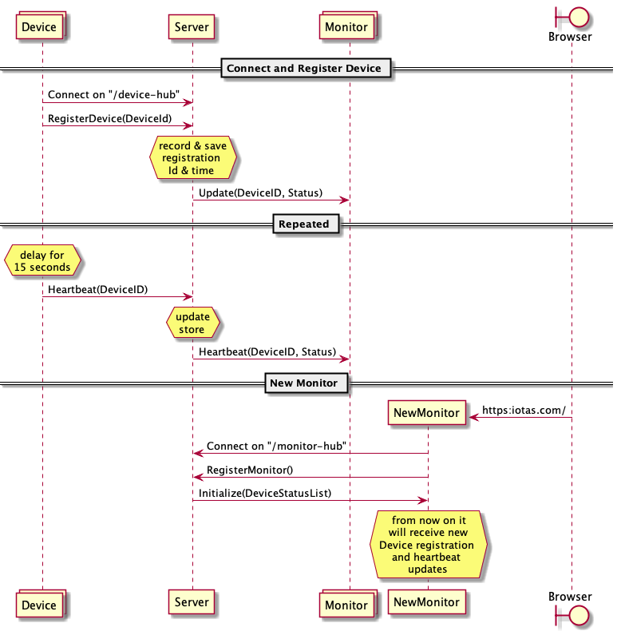

# Architecture

The solution consists of three components: 

1. Smart Speaker IoT Device
1. Monitor Web App
1. IoTAS Web Server

The Device is implemented as a .NET 5 console app, the Monitor is a Blazor web-assembly Single Page Application (SPA), while the Web Server is implemented using ASP.NET Core 5. There can be zero or more Devices and Monitors; but obviously there is only a single Server in any given deployment.

The smart speaker Device emulates a smart speaker in the public address system of the airport.
The Monitor web app displays the status of all known Devices in real-time.
The Server maintains the status of the Devices, serves the Monitor SPA, and provides SignalR hubs for the Devices and Monitors to connect to and pass real-time updates through.


### Life Cycle

A Device connects to the ```/device``` SignalR port of the Server. 
If succesfull, it registers itself with a unique ```DeviceId``` (currently based on user input). 
It then proceeds to send a ```Heartbeat``` signal to the Server every 15 seconds. 
If a Device looses its connection due to a network error, or the server going down, it keeps trying to re-connect and re-register with an incremental backoff time.

The Monitor loads in any browser on the ```/``` (index) page of the Server. 
It starts by connecting to the ```/monitor``` SignalR port of the Server and, like the Devices, registers itself. 
It then waits for incoming messages from the Server to update its user interface. 
Similar to the Devices, it will try to re-connect and re-register upon loosing the connection.

The Server starts and then waits for Devices and Monitors to connect on their respective SignalR ports and to register themselves. 
For Devices it records the DeviceId and the ```RegisteredAt``` and the the ```LastSeenAt``` time in the ```DeviceStatusStore```. 
It will then multicast the full ```DeviceStatus``` of that Device to all registered Monitors.
For each ```Heartbeat``` received, it multicasts the updated status for that DeviceId to all registered Monitors.
When a new Monitor registers, the Server immediately sends it the ```DeviceStatusList```, a list of all known Devices and their current status.
It then adds the Monitor to the known Monitors so that it will receive the ```DeviceStatus``` for newly registerd Devices as well as new ```Heartbeat``` updates.



Note: the Server guarantees in-order delivery of the initial ```DeviceStatusList``` (upon Monitor registration) and subsequent heartbeat messages.

