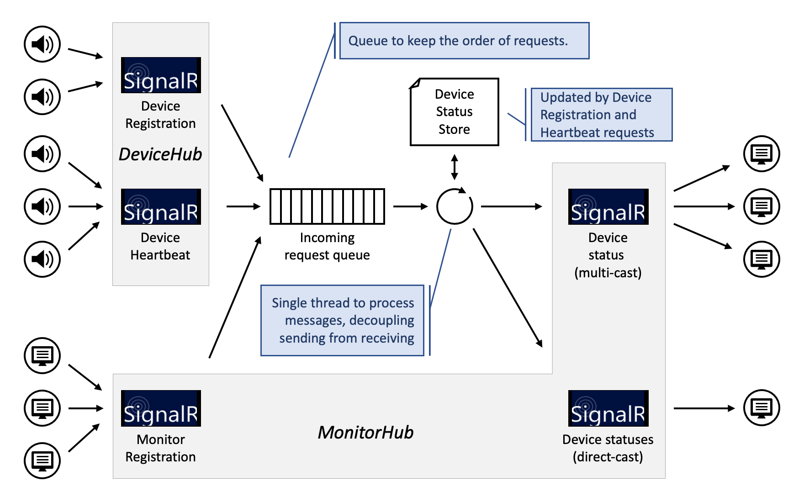

# Architecture

The solution consists of three subsystems: 

1. Smart Speaker IoT Device
1. Monitor Web App
1. IoTAS Web Server

The Device is implemented as a .NET 5 console app, the Monitor is a Blazor web-assembly Single Page Application (SPA), while the Web Server is implemented using ASP.NET Core 5. There can be zero or more Devices and Monitors; but obviously there is only a single Server in any given deployment.

The smart speaker Device emulates a smart speaker in the public address system of the airport.
The Monitor web app displays the status of all known Devices in real-time.
The Server maintains the status of the Devices, serves the Monitor SPA, and provides SignalR Hubs for the Devices and Monitors to connect to and pass real-time updates through.




### Life Cycle

A Device connects to the ```/device-hub``` SignalR port of the Server. 
If succesfull, it registers itself with a unique ```DeviceId``` (currently based on user input). 
It then proceeds to send a ```Heartbeat``` signal to the Server every 15 seconds. 
If a Device looses its connection due to a network error or the server going down, it tries to re-connect and re-register and keeps doing so, with an incrementing backoff time, until succesful or cancelled.

The Monitor loads in any browser on the ```/``` (index) page of the Server. 
It starts by connecting to the ```/monitor-hub``` SignalR port of the Server and, like the Devices, registers itself. 
It then waits for incoming messages from the Server to update its user interface. 
Similar to the Devices, it will try to re-connect and re-register upon loosing the connection.

The Server starts and then waits for Devices and Monitors to connect on their respective SignalR ports and to register themselves. 
For Device registrations, it records the DeviceId and the ```RegisteredAt``` and the ```LastSeenAt``` times in the ```DeviceStatusStore```. 
It will then multicast the full ```DeviceStatus``` of that single ```Device``` to all registered Monitors.

For each ```Heartbeat``` received, the Server updates the Device status' ```LastSeenAt``` time for that ```DeviceId```, and then multicasts a heartbeat update to all registered Monitors.

Lastly, when a Monitor registers, the Server immediately sends it the ```DeviceStatusList```, which is a list of all known c.q. registered Devices and their current status.
It then adds that Monitor to the known Monitors, so that the Monitor will receive subsequent ```Heartbeat``` updates as well as the ```DeviceStatus``` update for newly registered Devices.


### Notes

1. The Server guarantees in-order delivery of the initial ```DeviceStatusList``` (upon Monitor registration) and subsequent Device heartbeat and status update messages.

2. The Device Status may contain additional information such as Device Name and Location. As that would imply some form of commissioning, those types of data are currently not implemented. The status does, however, record the ```FirstRegisteredAt``` time and the ```LastRegisteredAt``` time. It thus is possible to detect a re-registration, which would happen upon Device reboot or network failure.

3. Each Monitor keeps and maintains a snapshot of the Server's Device status store to display to the interactive user. The protocol (and the implementation) guarantee eventual consistency, which is sufficient for the use-case.

4.  Upon Monitor disconnects, the Monitor's local store will be cleared. It is rebuild upon succesful re-connect and re-registration.

