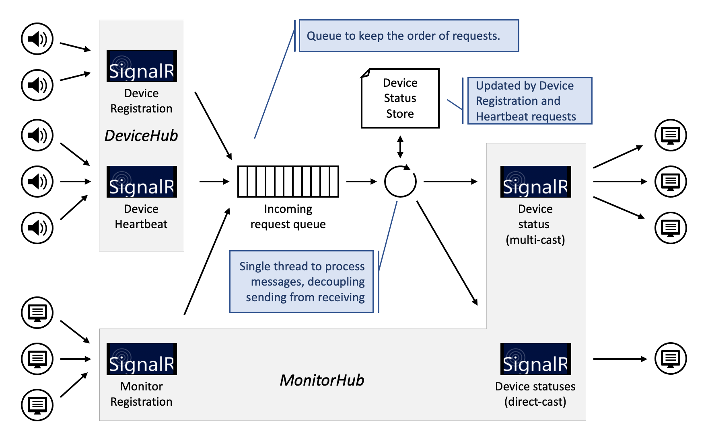

# 06 Server Design

The Server is implemented as an ASP.NET 5.0 web server, making full use of its standard features such as Hosting, Dependency Injection, and Logging.

It has two primary functions:

1. Serve the Monitor SPA static assets
2. Serve the Application protocol on the SignalR ports

The first is standard out-of-the-box behaviour, although IoTAS uses Serilog instead of the default logging provider.

The Application protocol implementation decouples the receiving of input messages (actually RPCs, Remote Procedure Calls) from processing and sending the resulting outgoing messages.
This is done with a thread-safe FIFO queue and a background thread for processing the messages.



The main benefit is that it is very easy to control the sequencing of operations that are triggered by SignalR input events.

In the first milestone, there are three input message event types:

1. Device Registration
2. Device Heartbeat
3. Monitor Registration

Each incoming request on the Hubs is time-stamped and captured in a ```Request``` record, and then added to the queue.
The queue is implemented as a singleton service (```HubsInputQueueService```) which, once created, runs for the lifetime of the Server.
It has the following interface:

```csharp
public interface IHubsInputQueueService : IDisposable
{
    Task<Request> DequeueAsync(CancellationToken token);
    void Enqueue(Request request);
}
```

The server maintains the current ```DeviceReportingStatus``` in a ```DeviceStatusStore```, which is modelled after a ```Dictionary<int, DeviceReportingStatus>``` and has the following interface:

```csharp
// The implementation needs to implicitly create an entry if an
// unknown (i.e. not seen before) deviceId is either updated with 
// a registration or a heartbeat command. As a result the result(s)
// are always "truthfull", with DateTime.MinValue use as "never".

public interface IDeviceStatusStore
{
    // The number of DeviceReportingStatus items in the Store
    public int Count { get; }

    // Remove all keys and DeviceReportingStatus items from the Store
    void Clear();

    // Get the current DeviceReportingStatus for the Device with DeviceId deviceId
    public DeviceReportingStatus GetDeviceStatus(int deviceId);

    // Get the current DeviceReportingStatus for all the Devices
    public IEnumerable<DeviceReportingStatus> GetDevicesStatusList();

    // Insert or update the DeviceReportingStatus in the store
    public void SetDeviceStatus(DeviceReportingStatus status);

    // Upate the Device Registration date and time for the Device with DeviceId deviceId.
    public DeviceReportingStatus UpdateRegistration(int deviceId, DateTime receivedAt);

    // Upate the Device Heartbeat date and time for the Device with DeviceId deviceId 
    public DeviceReportingStatus UpdateHeartbeat(int deviceId, DateTime receivedAt);
}
```

Currently, there is one implementation for the IDeviceStatusStore, which is ```VolatileDeviceStatusStore```.
It wraps a ```Dictionary<int, DeviceReportingStatus>``` and thus keeps the data in memmory.
In any real deployment, this would more likely be implemented as a Database backed store and also coupled with Device commisioning logic.
As the Background Service is the only thread accessing the store, its implementation does not have to be thread-safe.
	
>Note that the Monitor Client uses the same ```VolatileDeviceStatusStore``` to keep and update its local snapshot (based on the messages it receives from the Server). 

Request processing is implemented as a Hosted service (```InputProcessorHostedService```) that inherits from the framework's ```BackgroundService```.
Its ```ExecuteAsync``` method loops with an asynchronous wait on the ```IHubsInputQueueService``` (passed in through dependency injection) to obtain the next ```Request``` from the queue and then dispatches the ```Request``` to be processed by Request specific handlers.
Cancellation by the Host or a fatal error terminates the execution.

```csharp
// Called by the ASP.NET infrastructur upon startup ...
protected override async Task ExecuteAsync(CancellationToken stoppingToken)
{
    bool fatalError = false;

    while (!stoppingToken.IsCancellationRequested && !fatalError)
    {
        try
        {
            Request request = await inputQueue.DequeueAsync(stoppingToken);

            await ProcessRequest(request);
        }
        catch (OperationCanceledException e)
        {
            // "Cancellation requested - EXITING
        }
        catch (Exception e)
        {
            // Error dequeueng request - EXITING");
            fatalError = true; ;
        }
    }
}
```

The processing of the requests is now very simple, the ```ProcessRequest``` method delegates to the specific request handler based on the type of the input DTO that is embedded in the ```Request```:


```csharp
private async Task ProcessRequest(Request request)
{
    switch (request.ReceivedDto)
    {
        case DevToSrvDeviceRegistrationDto:
            await ProcessDeviceRegistrationAsync(
                (DevToSrvDeviceRegistrationDto)request.ReceivedDto, request.ReceivedAt);
            break;

        case DevToSrvDeviceHeartbeatDto:
            await ProcessDeviceHeartbeatAsync(
                (DevToSrvDeviceHeartbeatDto)request.ReceivedDto, request.ReceivedAt);
            break;

        case MonToSrvRegistrationDto:
            await ProcessMonitorRegistrationAsync(
                (MonToSrvRegistrationDto)request.ReceivedDto, request.ConnectionId);
            break;

        default:
            // Unknown request.ReceivedDto type
            break;
    }
}
```

Each ProcesXxxAsync handler then interacts with the DeviceStatusStore and the MonitorHub to do what is needed, e.g. the Device Registration code looks like this:

```csharp
private async Task ProcessDeviceRegistrationAsync(
    DevToSrvDeviceRegistrationDto dtoIn, 
    DateTime timeStamp)
{
    DeviceReportingStatus status = store.UpdateRegistration(dtoIn.DeviceId, timeStamp);
  
    var dtoOut = status.ToStatusDto();

    try
    {
        await monitorHubContext.Clients.Group(registeredMonitorssGroup)
            .ReceiveDeviceStatusUpdate(dtoOut);
    }
    catch (Exception e)
    {
        // Error in ReceiveDeviceStatusUpdate multicast
    }
}

```

The Device Heartbeat processing is very similar to the DeviceRegistration processing and therefor not shown here.
Monitor registration is also similar but sufficiently different to show:

```csharp
private async Task ProcessMonitorRegistrationAsync(
    MonToSrvRegistrationDto dtoIn,
    string connectionId)
{
    var dtoOut = store.GetDevicesStatusList()
        .Select(status => status.ToStatusDto())
        .ToArray();

    try
    {
        // Provide the registering Monitor with the current status of all Devices
        // If the number of devices gets too big, this could conditially be done in chunks
        await monitorHubContext.Clients.Client(connectionId)
            .ReceiveDeviceStatusesSnapshot(dtoOut);
    }
    catch (Exception e)
    {
        // Error in ReceiveDeviceStatusesSnapshot singlecast
    }

    // Ensure it will get future status updates
    await monitorHubContext.Groups.AddToGroupAsync(connectionId, registeredMonitorsGroup);
}
```

One might think that handling all input messages with a single thread becomes a performance bottleneck and needlesly serializes the processing of the incoming messages. 
But that serialization is -imho- exactly its strength. 
Now it is easy to guarantee that a newly registered Monitor first is fully initialized with the current ```DeviceStatusList``` before it receives Device registration updates or hearbeat updates and that no updates will be missed while this initialization is taking place.
Also note that the serialization would otherwise likely occur at the SignalR level, so we really do not loose much, if anything.

## Improvement Opportunities

### Use Framework's ```ConcurrentQueue<T>``` implementation

The ```HubsInputQueueService``` is implemented with a ```Queue<Request>``` as internal backing queue, a ```lockObject``` for thread-safe access to the queue, and a ```SemaphoreSlim``` for async item retrieval synchronization. 
This primarily done as a learning excercise.

The base class library contains a ```ConcurrentQueue<T>``` class (in the ```System.Collections.Concurrent``` namespace) that provides all of the required operations and more.
Out of the box, it supports e.g. an upper limit on the number of items in the queue with async blocking when adding an item.
It should also be slighly more performant.
Hence, I would use it in a high trafic situation.

### Implement Back-pressure

The current application SignalR protocol does not support it explicitly, but it would be relatively easy to add options so that the Server could apply back-pressure to the Devices.
A low-tech solution would be to delay the handling of the Device's heartbeat RPC until the queue depth is below a certain threshold.
A more sophisticated method would return the next heartbeat delay in the call, again based on the actual queue depth.
This would make the overall solution more robust.

### Make Calling the Monitor Client RPC methods Cancelable

The root ```ExecuteAsync``` method, which is called from the ASP.NET Core infrastructure on startup, is passed a ```CancellationToken```. 
The Background Service (that we inherit from) contract requires that the service honours this ```CancellationToken``` and quickly an cleanly terminates when the token is cancelled.

This is implemented while waiting on the input queue, but not when dispatching a ```Request```.
I have not found how to do so from outside a strongly typed Hub, i.e. from the ```IHubContext<MonitorHub, IMonitorHub>```.
Note that the ```SendAsync``` methods on an untyped ```Hub``` have overloads with a ```CancellationToken``` parameter.
But as soon as you define a ```Hub<T>```, the ```SendAsync``` method becomes unavailable (in favour of the methods defind in ```T```).
Being able to pass down the ```stoppingToken``` through the dispatching chain to the ```Hub```'s sending methods would be a nice improvement to have.

